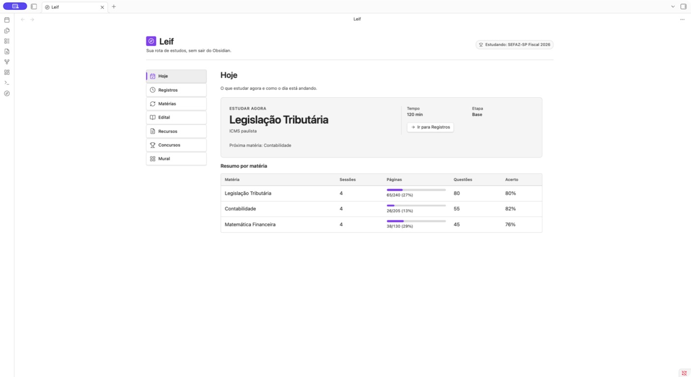

# Leif

**A bússola do seu estudo.**

Leif é um plugin para [Obsidian](https://obsidian.md/) que organiza estudos para concursos em um único painel.

Ele reúne concursos, matérias, tópicos do edital, materiais e sessões de estudo para mostrar o que estudar agora e acompanhar o progresso sem sair do Obsidian.
